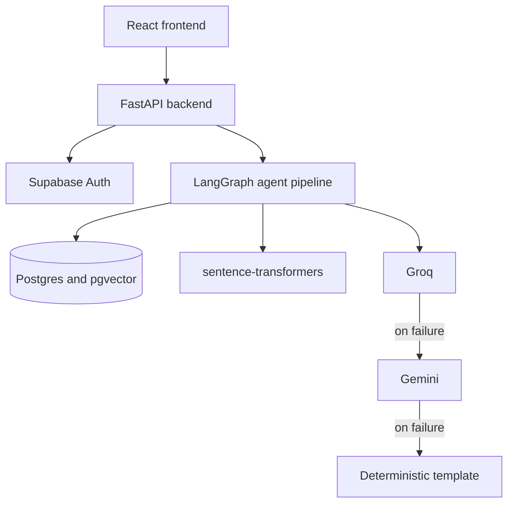
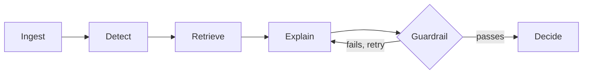

# Synchrony Fraud Agent

A real-time fraud detection system for digital lending, built for the Synchrony
Technology Hackathon. It scores loan disbursements, installment payments, and card
transactions as they happen, explains its reasoning in plain language, and keeps a
permanent record of how each decision was made.

## Overview

Digital lending moves fast. A loan disbursement settles in seconds, so fraud has to be
caught before the money moves, not in a report the following week. Fraud also does not
stay still: synthetic identities, promotional financing abuse, and account takeover all
shift shape over time, which is a poor fit for a static rules engine that only knows
what it was told at launch.

This project treats both problems as first-class constraints. Every transaction is
scored by a hybrid machine learning model, compared against thousands of historical
cases, and given a decision an analyst can trust and audit later, not just a number.
The scoring itself runs through an agentic pipeline built with LangGraph rather than one
large function. Six nodes each do a single job: a transaction is ingested, scored,
matched against precedent, explained in English, checked for factual accuracy, and
finally decided on, with every step written to a permanent log. A language model writes
the explanation, but it never makes the decision. Whether a transaction is allowed,
escalated, or blocked comes from a fixed threshold on a score computed before the model
says a word.

A React interface sits on top for the analyst: a risk queue sorted by score, a
transaction detail page with the full decision trail, and an analytics dashboard, all
gated by role, with an admin seeing more of the underlying reasoning than an analyst
does.

## Architecture



Inside the pipeline, six nodes pass a shared state object to each other in order, with
one deliberate loop:



`Ingest` writes the transaction to Postgres. `Detect` scores it with the fused model.
`Retrieve` finds similar historical cases with a pgvector cosine search. `Explain` asks
an LLM to write up the reasoning. `Guardrail` checks that explanation against the
underlying evidence and sends it back to `Explain` if it invented something, up to
twice, before falling back to a template. `Decide` applies a fixed threshold to the
score `Detect` already produced, a number that existed before the LLM was ever called.

## Stack

- **Backend**: FastAPI, LangGraph, XGBoost, scikit-learn (Isolation Forest),
  sentence-transformers, on Supabase (Postgres + pgvector)
- **Frontend**: React 19, Vite, React Router, Recharts, the Supabase JS client
- **Language model**: Groq (`openai/gpt-oss-120b`), falling back to Gemini and then a
  deterministic template

Everything here runs on a free tier.

## Design choices

The brief's reference architecture is written in AWS terms. Here is what actually got
built instead, and why.

The backend is FastAPI rather than Spring Boot. Both give a typed, dependency-injected
web framework with real request validation; the difference is language and ecosystem.
FastAPI let a small team move quickly in Python, with Pydantic doing the same schema
validation job Spring's request binding would do in Java, without giving up structure or
testability.

The language model layer runs on Groq instead of AWS Bedrock. Groq hosts
`openai/gpt-oss-120b` behind an API that plays the same role Bedrock plays on AWS: a
managed foundation model called over HTTP rather than operated in-house. It also has a
usable free tier and unusually low inference latency, which matters when an analyst is
waiting on an explanation.

Deployment was meant to be Render for the backend and Vercel for the frontend, standing
in for AWS's hosting layer. That step was not finished before submission; see Known
limitations.

## Evaluation

The model is trained on a stratified 300,000-row sample of the real PaySim dataset,
split by time rather than at random: everything after a cutoff step is held out as the
test set, so the model is never evaluated on data from before its own training window.
A single split can flatter or punish a model depending on luck, so the table below also
reflects five-fold rolling-origin cross-validation, where the training window slides
forward across five consecutive slices of time. Full numbers live in
[`backend/artifacts/metrics.json`](backend/artifacts/metrics.json).

| Metric | Value |
|---|---|
| Precision at the deployed block threshold (0.75) | 94.6% |
| Recall at the deployed escalate threshold (0.4) | 85.1% |
| Fused AUC-PR, deployed model | 0.839 |
| Mean AUC-PR, five-fold temporal cross-validation | 0.857 (± 0.062) |
| XGBoost vs. logistic regression, AUC-PR | 0.926 vs. 0.720 |

Two things in these numbers deserve an explanation rather than a footnote.

An earlier feature set, which included how cleanly a transaction's balances reconciled
and whether an account was drained to exactly zero, produced precision, recall, and
AUC-PR all around 1.0. That is not a result to celebrate on a real fraud problem; it is a
reason to go looking for a bug. The artifact here turned out to be genuine: PaySim's
synthetic fraud injection leaves an accounting signature clean enough for a model to key
on almost perfectly, in a way real fraud never would be. Those features are excluded
from the deployed model, and the numbers above are what remains once the shortcut is
gone.

The second finding surfaced later, while testing the live pipeline rather than the
training script. The supervised model's score for an identical transaction can swing
from roughly 3% to 55% depending only on the hour of day, a value derived from PaySim's
simulated `step` field and otherwise unrelated to the transaction itself. Live scoring
now falls back to the real current hour when a caller does not supply one, which at
least stops the system from committing to a specific wrong default. Retraining without
the feature entirely is still the right long-term fix, and it is the first item under
Roadmap.

## Security

Authentication runs through Supabase Auth, which signs tokens with ES256, an asymmetric
algorithm. The backend verifies each token against Supabase's public JWKS endpoint
(`backend/app/auth.py`), so there is no shared secret anywhere in the system that could
leak. Every business route requires an authenticated `analyst` or `admin` role, enforced
by a FastAPI dependency (`require_role`) and mirrored in Postgres row-level security
policies on all six tables, so a query that somehow bypassed the API would still be
denied by the database itself.

CORS is locked to the configured frontend origin rather than a wildcard, and every route
sits behind a rate limiter capped at 60 requests per minute per client. Every request
body is validated against a Pydantic schema before it reaches any business logic;
sending malformed data returns a structured 422, never a 500, which was verified
directly against every endpoint rather than assumed. Standard security headers and
structured request logging apply globally through middleware, alongside a plain health
check at `GET /api/health`.

The audit log the pipeline writes to, `agent_decision_log`, cannot be edited or deleted
once a row exists. That is enforced twice: those privileges are revoked at the database
level, and a foreign key blocks deleting a transaction that has any decision history.
This was tested directly rather than assumed. An attempt to delete a decisioned
transaction fails with a real foreign key violation, not a silent no-op. Secrets live
only in a gitignored `.env` file, and a full dependency audit brought known CVEs from 40
down to zero, re-verified live rather than taken on faith from an earlier run.

## Responsible AI

The language model explains a decision. It does not make one. `Decide` reads a risk
score that `Detect` already computed before `Explain` is ever called, so a complete LLM
outage would not change which transactions get blocked.

Personally identifiable information is stripped out of a transaction before it reaches
any prompt. `backend/agent/pii.py` scrubs account fields for social security numbers,
card numbers, emails, and phone numbers. An origin account of `jane.doe@example.com`
becomes `[EMAIL_REDACTED]` before an LLM ever sees it; a card number like
`4111 1111 1111 1111` becomes `[CARD_NUMBER_REDACTED]`. Both run inside `build_evidence()`
in the agent graph, ahead of every call to `Explain`.

The explanation itself is checked, not trusted outright. Every number the model states
gets compared against the actual evidence it was given: the scores, the amounts, the
balances, the similarity of retrieved cases. A number that does not trace back to
something real, or a mention of the wrong fraud pattern, fails the check and sends the
model back to try again, up to twice, before the system falls back to a template built
directly from the evidence instead of guessing a third time.

Every score also comes with its reasoning attached rather than left as a black box. The
top contributing features behind a decision are computed with XGBoost's native
SHAP-style attribution and shown directly on the transaction detail page.

One thing this system does not do yet is monitor for fairness or bias across
demographic groups. PaySim carries no demographic fields, so there is nothing in this
dataset to audit for disparate impact in the first place. A production system built on
real customer data would need per-segment monitoring of approve, escalate, and block
rates before launch, not just an aggregate precision and recall number. That is
documented here as future work rather than built.

## Testing

54 tests cover feature engineering, archetype tagging, the guardrail, PII scrubbing, the
risk model, authentication and RBAC, and the API layer, plus one end-to-end test that
runs a real transaction through the live pipeline against Supabase and Groq.

```bash
cd backend
pytest
```

This runs 53 of the 54. The live end-to-end test is marked `@pytest.mark.integration`
and excluded by default, because it inserts a real transaction into Supabase, and the
audit log it writes cannot be deleted afterward by design. Run it deliberately when you
want full live verification:

```bash
pytest -m integration
```

Two real bugs in this project survived a fully green suite before being found by hand: a
cascade-delete test whose own cleanup violated the constraint it was checking, and a
guardrail that flagged real account numbers as fabricated evidence because nothing in
its reference data included the account itself. Both are fixed now, with regression
tests added. The full account is in `LEARN_WITH_ME.md`, a personal engineering log kept
outside the repo. A green suite is a floor here, not proof.

## Getting started

### Backend

```bash
cd backend
python -m venv .venv
.venv\Scripts\activate
pip install -r requirements.txt
copy .env.example .env
uvicorn app.main:app --reload --port 8000
```

Fill in the Supabase and Groq keys in `.env` before starting the server. On Windows,
behind a corporate proxy or antivirus that intercepts TLS, also run
`pip install pip-system-certs` inside the virtual environment, or calls to Supabase and
Groq will fail with `CERTIFICATE_VERIFY_FAILED`.

### Frontend

```bash
cd frontend
npm install
copy .env.example .env
npm run dev
```

### Database

Apply the files in `supabase/migrations/` in order, through the Supabase SQL editor.

### Training the models

Model artifacts and the source dataset are both gitignored, so a fresh clone starts with
neither. Download PaySim from Kaggle (`ealaxi/paysim1`) to `data/raw/paysim.csv`, then
from `backend/`, with the virtual environment active:

```bash
python -m ml.data_prep
python -m ml.train
python -m ml.embeddings
```

`data_prep` subsamples the raw CSV and renames its columns. `train` fits both models and
writes the artifacts the scoring endpoint loads. `embeddings` seeds the historical case
bank that `Retrieve` searches against. The 500-row sample already committed at
`data/sample/lending_transactions_sample.csv` is enough to look at the schema, not
enough to train anything meaningful.

## Known limitations

- **No live deployment.** Render and Vercel were the intended targets, and both apps are
  ready to deploy, but the step itself was not completed before submission.
- **The Gemini fallback is untested against a real key.** The code path exists in
  `backend/agent/llm_client.py`, but this environment's `GEMINI_API_KEY` is a
  placeholder, so the fallback chain has only been observed reaching the deterministic
  template, never Gemini itself.
- **No fairness or bias monitoring**, for the reason described under Responsible AI.
- **The hour-of-day sensitivity described under Evaluation is mitigated, not resolved.**
  Retraining without the feature is the correct fix.

## Roadmap

1. Retrain without the hour-of-day feature, the honest fix for the artifact described
   above.
2. Close the feedback loop. `analyst_feedback` already captures human approve or block
   decisions; nothing yet retrains on them.
3. Deploy to Render and Vercel.
4. Move from request and response scoring to streaming ingestion for continuous traffic.
5. Grow the historical case bank past its current 3,000 seeded cases.
6. Verify a second LLM provider live, since Gemini currently is not.
