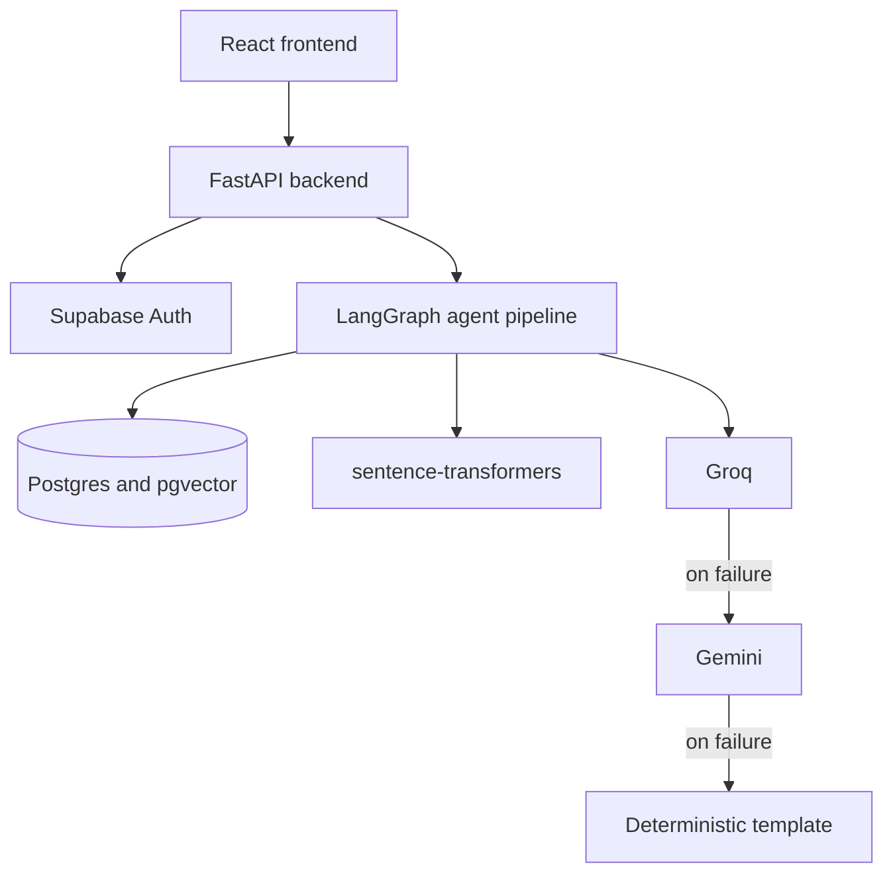
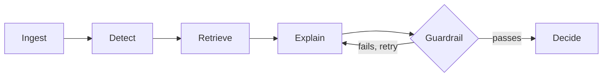

# Solaris

**Real-time fraud detection for digital lending.** Solaris scores loan disbursements,
installment payments, and card transactions the instant they happen, explains every score
in plain language, mechanically checks that explanation against real evidence before
anyone sees it, and writes an append-only record of how each decision was made. Built for
the Synchrony Technology Hackathon.

## At a glance

- **94.6% precision / 85.1% recall** at the deployed thresholds, 0.839 fused AUC-PR, on a
  real 300k-row PaySim sample, time-split and validated with 5-fold rolling-origin
  cross-validation (0.857 mean AUC-PR) — not a single lucky split.
- **A fused model, not one model.** XGBoost (labeled fraud) + a per-event-type Isolation
  Forest (unlabeled event types), because the training data only labels fraud on one of
  four transaction types.
- **A 6-node LangGraph pipeline** — `Ingest → Detect → Retrieve → Explain → Guardrail →
  Decide` — where an LLM writes the explanation and a separate, deterministic threshold
  makes the decision. The LLM cannot see or influence the decision.
- **Every LLM explanation is fact-checked before it ships.** A guardrail extracts every
  number the model states and confirms it traces back to real evidence, retrying up to
  twice, falling back to a deterministic template rather than ever risking a third
  fabrication.
- **~2.85s end-to-end, warm** (down from ~11.3s cold — a real, measured, instrumented fix,
  not an estimate).
- **Zero known CVEs**, RBAC enforced at both the API and the database (Postgres RLS), PII
  stripped before any data reaches a third-party LLM.
- **54 tests**, including one live end-to-end run against real Supabase and Groq.
- Two real bugs found in this project's own evaluation numbers and disclosed rather than
  hidden — see [Evaluation](#evaluation).

## Contents

- [Overview](#overview)
- [Architecture](#architecture)
- [Machine learning](#machine-learning)
- [Explainability and the guardrail](#explainability-and-the-guardrail)
- [Evaluation](#evaluation)
- [Security](#security)
- [Responsible AI](#responsible-ai)
- [Performance](#performance)
- [Testing](#testing)
- [Stack](#stack)
- [Design choices](#design-choices)
- [Getting started](#getting-started)
- [Known limitations](#known-limitations)
- [Roadmap](#roadmap)

## Overview

Digital lending fraud has two properties that make it hard: it has to be caught **before**
the money moves, and it keeps changing shape (synthetic identities, promotional-financing
abuse, account takeover), which is a poor fit for a static rules engine. Solaris addresses
both. Every transaction is scored by a hybrid ML model, compared against thousands of
historical cases by vector similarity, and given a decision an analyst can audit later —
not just a number.

## Architecture





| Node | Does | Reads |
|---|---|---|
| `Ingest` | Writes the transaction to Postgres | — |
| `Detect` | Scores with the fused model, computes archetype + top features | the record |
| `Retrieve` | pgvector cosine search against the historical case bank | Detect's output |
| `Explain` | LLM writes a plain-English rationale | everything gathered so far |
| `Guardrail` | Fact-checks the explanation against real evidence, retries or falls back | Explain's output |
| `Decide` | Applies a fixed threshold to `risk_score`, writes the decision | **only `Detect`'s score** |

`Decide` never reads anything `Explain` or `Guardrail` produced. If every LLM provider
were down, every transaction would receive the identical decision — only the explanation
text would degrade to the deterministic template.

A React interface sits on top: a risk queue sorted by score, a transaction detail page
with the full decision trail, and an analytics dashboard, all gated by role.

## Machine learning

| | |
|---|---|
| Supervised model | XGBoost, 300 trees, depth 6, trained only on `loan_disbursement` — the one event type PaySim labels |
| Anomaly model | Isolation Forest, 200 trees, **one per event type**, fit only on legitimate rows |
| Fusion weight | 70% supervised / 30% anomaly where labels exist, 60/40 tilted toward anomaly where they don't |
| Embeddings | `all-MiniLM-L6-v2`, 384-dim, ivfflat-indexed in pgvector, ~3,000 seeded cases |

**Why two models fused, not one.** PaySim only labels fraud on `loan_disbursement` events.
A classifier trained across all four event types correctly learns "the other three are
never fraud" from the data, and always scores them near zero — including a genuine account
takeover the dataset simply never labeled. The Isolation Forest needs no fraud labels at
all; it learns what *normal* looks like per event type and flags anything far outside that
envelope, catching fraud patterns the labeled data literally cannot teach a classifier to
see.

## Explainability and the guardrail

The `Explain` node asks an LLM (Groq's `openai/gpt-oss-120b`, falling back to Gemini, then
a deterministic template) to write a plain-English rationale grounded in the evidence
`Detect` and `Retrieve` gathered. The `Guardrail` node then does what most systems that
call an LLM skip:

1. Extract every number the explanation states.
2. Confirm each one traces back to something in the real evidence blob — scores, amounts,
   balances, retrieved-case similarity, even the account identifiers themselves.
3. Confirm the explanation names the same archetype `Detect` actually found.
4. On failure, retry `Explain` (up to twice) before falling back to a template built
   directly from the same evidence.

This is a mechanical check on numeric and categorical claims, not a general hallucination
detector — a model could still fabricate something qualitative without using a number, and
that's a named limitation, not a hidden one. Every score also carries its own reasoning:
top contributing features are computed with XGBoost's native SHAP-style attribution and
shown directly on the transaction detail page.

## Evaluation

Trained on a stratified 300,000-row PaySim sample, split by time (not randomly) so the
model is never graded on data from before its own training window, plus 5-fold
rolling-origin cross-validation as a check against any single lucky split. Full numbers:
[`backend/artifacts/metrics.json`](backend/artifacts/metrics.json).

| Metric | Value |
|---|---|
| Precision at block threshold (0.75) | 94.6% |
| Recall at escalate threshold (0.4) | 85.1% |
| Fused AUC-PR, deployed model | 0.839 |
| Mean AUC-PR, 5-fold temporal CV | 0.857 (± 0.062) |
| XGBoost vs. logistic regression | 0.926 vs. 0.720 AUC-PR |

Two things in this table came from deliberately distrusting a good-looking first result:

- **A near-1.0 AUC-PR the first time around was a red flag, not a win.** It traced to
  PaySim's fraud-injection process leaving an unrealistically clean accounting signature
  (balances that zero out exactly). Those near-deterministic features are excluded from
  the deployed model; the numbers above are what's left once that shortcut is removed.
- **An identical transaction could score 3% or 55% depending only on hour-of-day** — a
  PaySim training-time artifact, not a real risk signal. Live scoring now falls back to
  the real current hour instead of a silent zero-default. Retraining without the feature
  entirely is [Roadmap](#roadmap) item one.

## Security

- **Asymmetric auth, no shared secret.** Supabase Auth signs tokens with ES256; the
  backend verifies against Supabase's public JWKS endpoint. There is no JWT secret in this
  system that could leak.
- **RBAC enforced twice.** A `require_role` FastAPI dependency on every business route,
  mirrored in Postgres row-level security — a query that somehow bypassed the API still
  meets a wall at the database.
- **Rate limiting, security headers, and request logging** globally, via middleware:
  60 req/min default, HSTS, `X-Frame-Options`, `X-Content-Type-Options`, and every
  request logged with method, path, status, and duration. A plain health check is
  exposed at `GET /api/health`.
- **Secrets never enter the repo.** Live keys live only in a gitignored `.env`; the
  service-role key never leaves the backend.
- **Zero known CVEs**, re-verified live (`pip-audit`), down from 40 across 8 packages.
- **Append-only audit trail.** `agent_decision_log` cannot be edited or deleted —
  `UPDATE`/`DELETE` privileges are revoked at the database level, and a foreign-key
  `RESTRICT` blocks deleting a transaction with any decision history. Verified directly: a
  real deletion attempt fails with a real foreign-key violation, not a silent no-op.
- **Bounded, validated input.** Every field is length- and range-checked at the Pydantic
  layer before it reaches the database or the model; malformed input returns a structured
  `422`, verified against every endpoint.

## Responsible AI

- The LLM **explains** a decision; it never **makes** one — `Decide` reads a risk score
  `Detect` computed before `Explain` is ever called. This is structurally true, not a
  policy promise: a complete LLM outage would not change a single decision.
- **PII is stripped before any prompt.** `backend/agent/pii.py` redacts SSNs, card
  numbers, emails, and phone numbers inside `build_evidence()`, ahead of every call to
  `Explain`, without exception.
- **Human-in-the-loop feedback.** An analyst can confirm a transaction as fraud or mark it
  a false positive, with a note, from the transaction detail page — stored in
  `analyst_feedback` and shown back on the same page. Captured today; feeding it back into
  retraining is [Roadmap](#roadmap) item two.
- **No fairness/bias monitoring yet.** PaySim carries no demographic fields, so there is
  nothing in this dataset to audit for disparate impact — a gap in the data as much as the
  system, but one a real launch on customer data would need to close first.

## Performance

Per-node timing (`agent.perf` logger, `backend/agent/graph.py`) found the actual cost
before assuming one: on a cold run, `Detect` and `Retrieve` together spent about 9.2 of
11.3 seconds on model and embedder *loading*, not inference — including roughly fifteen
Hugging Face Hub calls the embedder made purely to confirm a locally cached model hadn't
changed.

| | Cold | Warm |
|---|---|---|
| End-to-end pipeline | ~11.3s | ~2.85s |

**Fix:** both models now load once at FastAPI startup (`@app.on_event("startup")`); the
embedder loads with `local_files_only=True` and never touches the network. Decision-log
writes were also batched from up to 8 inserts per run into 1, deferred to a background
task so the API response returns as soon as the decision is ready.

## Testing

```bash
cd backend
pytest
```

53 of 54 tests run by default — feature engineering, archetype tagging, the guardrail, PII
scrubbing, the risk model, auth/RBAC, the API layer. The 54th is a live end-to-end test
against real Supabase and Groq, marked `@pytest.mark.integration` and excluded by default
because its audit-log write is permanent by design:

```bash
pytest -m integration
```

A fully green suite still let two real bugs through, both found by reading live output
rather than trusting passing tests: a cascade-delete test whose own cleanup violated the
constraint it was checking, and a guardrail that briefly flagged real account numbers as
fabricated evidence. Both are fixed, with regression tests standing guard.

## Stack

| Layer | Technology |
|---|---|
| Backend | FastAPI, LangGraph, XGBoost, scikit-learn, sentence-transformers |
| Data | Supabase (Postgres + pgvector) |
| Frontend | React 19, Vite, React Router, Recharts |
| LLM | Groq (`openai/gpt-oss-120b`) → Gemini (`gemini-3.5-flash-lite`) → template |

Everything runs on a free tier — a constraint that forced every architectural choice to
earn its place on merit, not budget.

## Design choices

The hackathon's reference architecture is written in AWS terms; here's the direct mapping.

| Brief asks for | Used instead | Why equivalent |
|---|---|---|
| Spring Boot or equivalent | FastAPI | Same typed, dependency-injected request validation (Pydantic), different dialect |
| AWS Bedrock or equivalent LLM service | Groq | Same role — managed foundation model over HTTP — with lower inference latency and a usable free tier |
| AWS or equivalent deployment platform | Vercel (frontend only) | Real, durable, live deployment for the frontend. **The backend is the one honest gap** — it runs locally behind a Cloudflare tunnel with no uptime guarantee. Named directly under [Known limitations](#known-limitations), not hidden. |

## Getting started

### Backend

```bash
cd backend
python -m venv .venv
.venv\Scripts\activate
pip install -r requirements.txt
copy .env.example .env
uvicorn app.main:app --reload --port 8000
```

Fill in the Supabase and Groq keys in `.env` first. On Windows, behind a corporate proxy
or antivirus that intercepts TLS, also run `pip install pip-system-certs`, or calls to
Supabase and Groq will fail with `CERTIFICATE_VERIFY_FAILED`.

### Frontend

```bash
cd frontend
npm install
copy .env.example .env
npm run dev
```

### Database

Apply the files in `supabase/migrations/` in order, through the Supabase SQL editor.

### Training the models

Model artifacts and the source dataset are gitignored — a fresh clone starts with
neither. Download PaySim from Kaggle (`ealaxi/paysim1`) to `data/raw/paysim.csv`, then
from `backend/`, with the virtual environment active:

```bash
python -m ml.data_prep
python -m ml.train
python -m ml.embeddings
```

`data_prep` subsamples and renames columns. `train` fits both models and writes the
artifacts the scoring endpoint loads. `embeddings` seeds the historical case bank
`Retrieve` searches. The 500-row sample at
`data/sample/lending_transactions_sample.csv` is enough to inspect the schema, not enough
to train anything meaningful.

## Known limitations

- **No durable backend host.** Runs locally behind a Cloudflare quick tunnel, which
  carries no uptime guarantee — unlike the frontend's real Vercel deployment. The largest
  gap against the brief's cloud-deployment expectation.
- **`analyst_feedback` has manual, not automated, test coverage.**
- **Feedback is captured, not yet learned from.** Nothing retrains on `analyst_feedback`
  rows yet.
- **No fairness or bias monitoring** — PaySim has no demographic fields to audit.
- **Hour-of-day sensitivity is mitigated, not resolved** — see [Evaluation](#evaluation).

## Roadmap

1. Retrain without the hour-of-day feature; move the backend onto a durable host.
2. Feed `analyst_feedback` back into training instead of only storing it.
3. Move from request/response scoring to streaming ingestion.
4. Grow the historical case bank past its current 3,000 seeded cases.
5. Add automated tests for the analyst-feedback endpoint.
