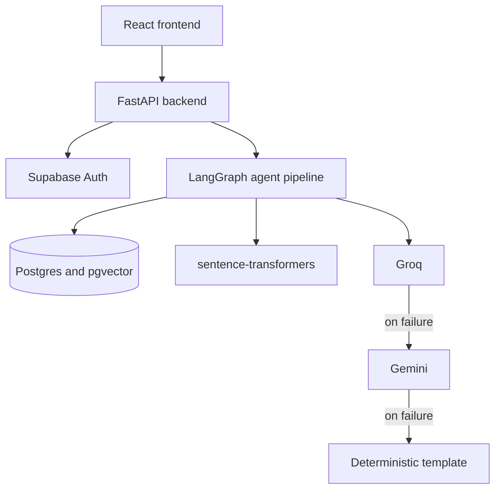
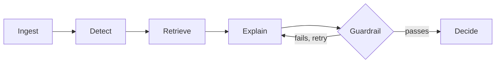

# Solaris

At 2:51 in the afternoon, a loan disbursement of nine thousand five hundred dollars
leaves an origin account and arrives, whole, in another. The balance on one side falls to
zero. The balance on the other rises by exactly that amount. Somewhere behind that single
transfer, in the space of about three seconds, a fused machine learning model scores the
transaction, a vector search surfaces the historical cases it most resembles, a language
model writes up why in a sentence a person can check, a second system checks that sentence
against the evidence before letting it stand, and a decision is reached and written down
permanently — before the money has finished settling, not after. This is what Solaris does,
every time, on real data, verified live rather than assumed. This document is an account
of how it works and what it has earned the right to claim.

It was built for the Synchrony Technology Hackathon: a real-time fraud detection system
for digital lending that scores loan disbursements, installment payments, and card
transactions as they happen, explains its reasoning in language an analyst can act on, and
keeps a permanent, tamper-evident record of how every decision was made.

## What it does well

The scoring pipeline is fast, explainable, and answerable to a human. A fused XGBoost and
Isolation Forest model reaches 94.6% precision at the deployed block threshold and 85.1%
recall at the deployed escalate threshold, an AUC-PR of 0.839 on a real 300,000-row PaySim
sample, split by time rather than at random so the model is never graded on data from
before its own training window — and that number holds up under five-fold rolling-origin
cross-validation, 0.857 mean AUC-PR, not just on the one split that happened to be run.
XGBoost beats a logistic regression baseline by a wide margin, 0.926 to 0.720 AUC-PR,
which is the kind of gap that justifies the more complex model rather than assumes it.
Full numbers live in [`backend/artifacts/metrics.json`](backend/artifacts/metrics.json).

The explanation layer is not a black box bolted on for show. Every number a language model
states in its explanation is checked against the actual evidence it was given — scores,
amounts, balances, the similarity of retrieved cases — and a claim that cannot be traced
back to something real sends the model back to try again before anything reaches the
analyst. The decision itself never depends on the explanation succeeding: `Decide` reads a
risk score that `Detect` already computed before the language model was ever called, so a
total outage of every LLM this system knows how to call would not move a single
transaction from allowed to blocked. The reasoning can vanish; the judgment underneath it
cannot be talked out of existing.

Security was built in, not bolted on, and verified rather than assumed. Authentication
runs on Supabase's ES256-signed tokens, so no shared secret exists anywhere that could
leak. Every route enforces role-based access twice over — once in FastAPI, once again in
Postgres row-level security — so a query that somehow bypassed the API would still meet a
wall at the database. The audit log cannot be edited or deleted once written, enforced at
the database level and confirmed with a real deletion attempt that failed exactly as
designed. A full dependency audit brought known CVEs from forty down to zero, re-checked
live rather than trusted from an earlier run. Fifty-four tests cover the model, the
guardrail, PII scrubbing, auth, and the API layer end to end, including one that runs a
real transaction through the live pipeline against Supabase and Groq.

The system also found and fixed a real performance problem before it could become a live
one. Per-node timing traced a cold pipeline run to two models and an embedder loading on
whichever request happened to arrive first — 9.2 of roughly 11.3 seconds was pure setup
cost, not inference. Warming both models at startup and cutting a redundant network check
out of the embedder's load path took the same transaction, run warm, down to roughly 2.85
seconds — a four-fold improvement, found by instrumenting the system rather than guessing
at it, and confirmed with the same logging both times.

## Architecture



Six nodes pass one shared state object between them in a fixed order, with a single
deliberate loop — the one place the system is allowed to check itself before it speaks:



`Ingest` writes the transaction to Postgres. `Detect` scores it with the fused model.
`Retrieve` runs a pgvector cosine search against thousands of historical cases for
precedent. `Explain` asks a language model to write the reasoning up in plain English,
grounded in what `Detect` and `Retrieve` actually found. `Guardrail` checks that
explanation against the evidence the way an editor checks a quote against the transcript,
sending it back to `Explain` up to twice before falling back to a template built directly
from the evidence. `Decide` applies a fixed threshold to the score `Detect` already
produced. A React interface sits above all of this: a risk queue sorted by score, a
transaction detail page with the full decision trail, and an analytics dashboard, gated by
role.

## Stack

- **Backend**: FastAPI, LangGraph, XGBoost, scikit-learn (Isolation Forest),
  sentence-transformers, on Supabase (Postgres + pgvector)
- **Frontend**: React 19, Vite, React Router, Recharts, the Supabase JS client
- **Language model**: Groq (`openai/gpt-oss-120b`), falling back to Gemini and then a
  deterministic template

Everything here runs on a free tier, a constraint that forced every architectural choice
to earn its place on merit rather than budget.

## Design choices

The hackathon's reference architecture is written in AWS terms. FastAPI stands in for
Spring Boot, giving the same typed, dependency-injected request validation in a dialect
that let a small team move fast. Groq stands in for AWS Bedrock, playing the identical
role — a managed foundation model behind an HTTP call — with a usable free tier and
inference latency low enough to matter when an analyst is reading a live explanation.
Vercel stands in for the frontend's hosting layer, and it is a real, durable, currently-live
deployment. The backend runs locally and reaches that deployment through a Cloudflare
tunnel; that piece has no equivalent durable host yet, and it is the top item under Roadmap.

## Responsible AI

The language model explains a decision; it never makes one, for the architectural reason
described above. Personally identifiable information is stripped from every transaction
before it reaches a prompt — `backend/agent/pii.py` redacts social security numbers, card
numbers, emails, and phone numbers inside `build_evidence()`, ahead of every call to
`Explain`, without exception. Every score carries its own reasoning rather than arriving
as a black box: the top contributing features behind a decision are computed with
XGBoost's native SHAP-style attribution and shown directly on the transaction detail page.

An analyst can confirm a transaction as fraud or mark it a false positive, with an
optional note, and that record is stored in `analyst_feedback` and shown back on the same
page — a real place for the human judgment a purely automated score cannot carry on its
own. Feeding that record back into training is the next step, covered under Roadmap.

## Getting started

### Backend

```bash
cd backend
python -m venv .venv
.venv\Scripts\activate
pip install -r requirements.txt
copy .env.example .env
uvicorn app.main:app --reload --port 8000
```

Fill in the Supabase and Groq keys in `.env` before starting the server. On Windows,
behind a corporate proxy or antivirus that intercepts TLS, also run
`pip install pip-system-certs` inside the virtual environment, or calls to Supabase and
Groq will fail with `CERTIFICATE_VERIFY_FAILED`.

### Frontend

```bash
cd frontend
npm install
copy .env.example .env
npm run dev
```

### Database

Apply the files in `supabase/migrations/` in order, through the Supabase SQL editor.

### Training the models

Model artifacts and the source dataset are both gitignored, so a fresh clone starts with
neither. Download PaySim from Kaggle (`ealaxi/paysim1`) to `data/raw/paysim.csv`, then
from `backend/`, with the virtual environment active:

```bash
python -m ml.data_prep
python -m ml.train
python -m ml.embeddings
```

`data_prep` subsamples the raw CSV and renames its columns. `train` fits both models and
writes the artifacts the scoring endpoint loads. `embeddings` seeds the historical case
bank that `Retrieve` searches against. The 500-row sample already committed at
`data/sample/lending_transactions_sample.csv` is enough to inspect the schema, not enough
to train anything worth trusting.

## Testing

```bash
cd backend
pytest
```

Fifty-three of fifty-four tests run by default, covering feature engineering, archetype
tagging, the guardrail, PII scrubbing, the risk model, auth and RBAC, and the API layer.
The fifty-fourth is a live end-to-end test against real Supabase and Groq, marked
`@pytest.mark.integration` and excluded by default because its audit-log write cannot be
deleted afterward, by design:

```bash
pytest -m integration
```

A fully green suite still let two real bugs through before they were caught by hand: a
cascade-delete test whose own cleanup violated the constraint it was checking, and a
guardrail that briefly flagged real account numbers as fabricated evidence. Both are fixed
now, with regression tests standing guard where they were found — a reminder that a green
suite is the floor here, not the finish line.

## Sharpest edges, and what closes them

- The backend has no durable cloud host yet — it runs locally behind a Cloudflare tunnel
  while the frontend has a real, durable Vercel deployment. Closing this gap is Roadmap
  item one.
- Analyst feedback is captured and displayed but does not retrain the model yet — the
  human-in-the-loop capture step is built; the learning step is next.
- The `analyst_feedback` route has manual but not automated test coverage.
- PaySim carries no demographic fields, so there is no fairness or bias monitoring to build
  against this dataset; a production launch on real customer data would need it.
- One model feature (hour of day) is sensitive to a PaySim artifact; live scoring already
  falls back sensibly when the caller omits it, and retraining without the feature
  entirely is Roadmap item one alongside the deployment gap.

## Roadmap

1. Retrain without the hour-of-day feature and move the backend onto a durable host.
2. Feed `analyst_feedback` back into the model instead of only storing it.
3. Move from request-and-response scoring to streaming ingestion for continuous traffic.
4. Grow the historical case bank past its current 3,000 seeded cases.
5. Add automated tests for the analyst-feedback endpoint.
